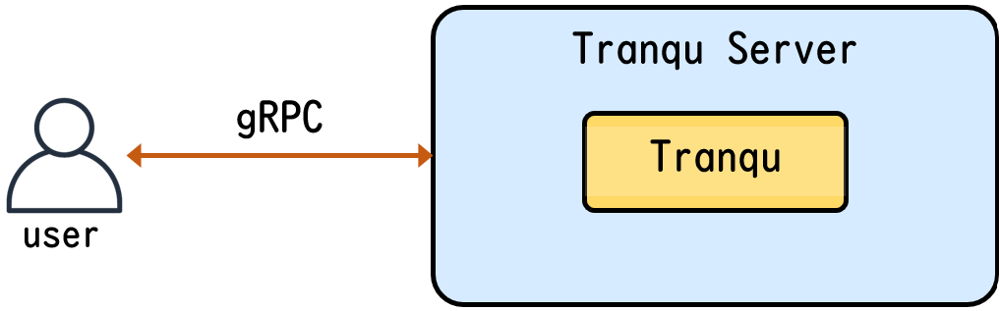

# Tranqu Server

## Overview

**Tranqu Server** is a transpiler service application using [Tranqu](https://tranqu.readthedocs.io/).

Transpilers consume computational resources based on the size of quantum circuits. As a result, service providers may prefer to offer them as a service, such as the [Qiskit Transpiler Service](https://docs.quantum.ibm.com/guides/qiskit-transpiler-service).
Tranqu Server is a service application built with Tranqu designed to provide transpilers access via protocols like gRPC. By using Tranqu Server, you can integrate Tranqu into your system as a service, enabling efficient use of transpilers.

The current version supports a gRPC server, and we plan to include RESTful API support and additional features.

## Features

- **gRPC Server**: Provides Tranqu as a gRPC server service.

## Usage

- [Getting Started](./usage/getting_started.md)
- [Interface Specifications](./usage/interface_specifications.md)

## API reference

- [API reference](./reference/API_reference.md)

## Developer Guidelines

- [Development Flow](./developer_guidelines/index.md)
- [Setup Development Environment](./developer_guidelines/setup.md)
- [How to Contribute](./CONTRIBUTING.md)
- [Code of Conduct](./CODE_OF_CONDUCT.md)
- [Security](./SECURITY.md)

## Citation

You can use the DOI to cite Tranqu Server in your research.

Citation information is also available in the [CITATION](https://github.com/oqtopus-team/tranqu-server/blob/main/CITATION.cff) file.

## Contact

You can contact us by creating an issue in this repository or by email:

- [oqtopus-team[at]googlegroups.com](mailto:oqtopus-team[at]googlegroups.com)

## License

Tranqu Server is released under the [Apache License 2.0](https://github.com/oqtopus-team/tranqu-server/blob/main/LICENSE).

## Supporting

This work was supported by JST COI-NEXT, Grant No. JPMJPF2014.
A part of this work was performed for Council for Science, Technology and Innovation (CSTI), Cross-ministerial Strategic Innovation Promotion Program (SIP), ‘Building and operation of a domestically developed quantum computer testbed environment’ (funding agency: QST).
